<h1 align="center">Java I (Conceitos Básicos)</h1>
<p align="center">Thiago Sakurai Paschoal</p>

Tabela de conteúdos
=================
<!--ts-->

* [O que precisamos ter no nosso cinto de utilidades antes de começar?](#cinto-utilidades)
* [Instalando o ambiente Java](#ambiente-java)
* [Instalando e configurando o Eclipse](#ambiente-eclipse)
* [Criando e executando nosso primeiro programa Java](#hello-world)
* [Criando dados para nosso programa (Variáveis)](#variaveis)
* [Dando poder de decisão para nosso programa](#estruturas)
* [Falando um pouco sobre classes e objetos](#oo)
* [Exercicios](EXERCICIOS.md)

<!--te-->

<h3 id="cinto-utilidades">
    <h1>📥 O que precisamos ter no nosso cinto de utilidades antes de começar?</strong>
</h3>


Antes de começar, aviso de que este é um treinamento proibido para menores de 18 anos e que este só devem assistir acompanhados dos pais/responsáveis. **Brincadeiraaaa!!!!**. Antes de começar, você vai precisar ter instalado em sua máquina as seguintes ferramentas:

1. [JDK (8)](https://www.oracle.com/br/java/technologies/javase/javase8-archive-downloads.html)

2. [Eclipse](https://www.eclipse.org/downloads/)

**O que é JDK? JVM? JRE?**

<div id="ambiente-java">
    <h1>Instalando o ambiente Java</h1>
</div>

1. Selecione qual distribuição deseja baixar de acordo com seu sistema operacional.

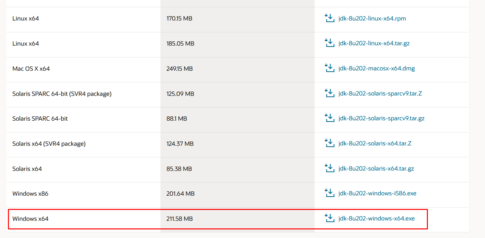

2. Marque os termos da Oracle (checkbox) e depois clique no botão verde

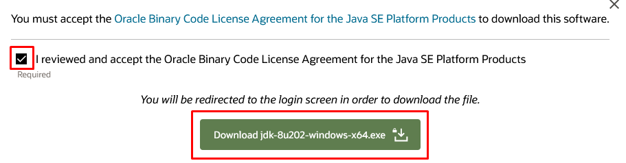

3. Para seguir com o download é necessário você ter uma conta Oracle. Caso não tenha, crie uma! Vc não paga nada por isso.


4. Download realizado com sucesso!

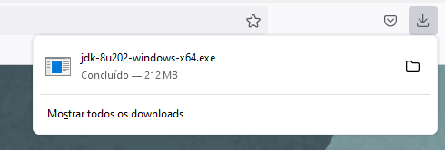

5. Siga o passo-a-passo do procedimento de instalação (***Next, Next, Next...***)

6. Após finalizar a instalação, nas adicione essas informações nas variáveis de ambiente do seu SO.

    6.1. Digite variáveis na caixa de pesquisa do 'Windows' e depois clique em 'Editar as variáveis de ambiente do sistema'

    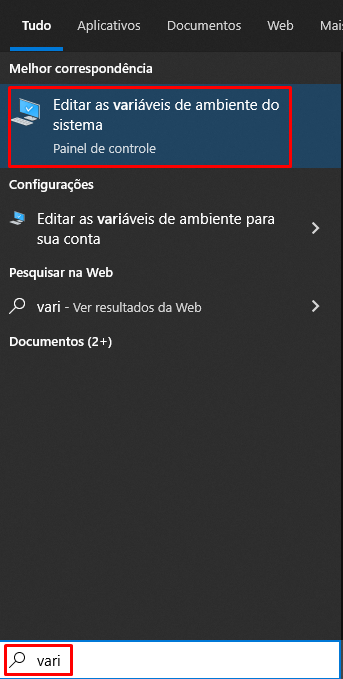

    6.2. Clique em 'Variaveis de Ambiente'

    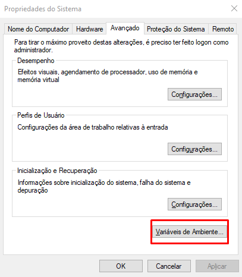

    6.3. Adicione a variavel chamada ***JAVA_HOME*** no grupo 'Variaveis de ambiente'.

    ```code
    JAVA_HOME = C:\Program Files\Java\jdk1.8.0_202
    ```
    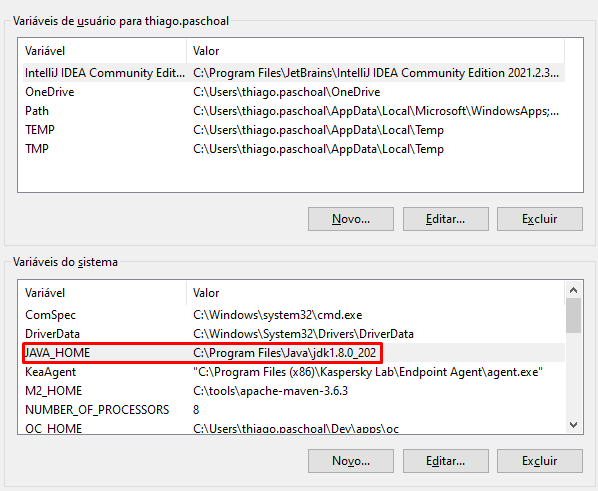

    6.4. Depois adicione a mesma variável agora, em conjunto com a variável ***PATH***

    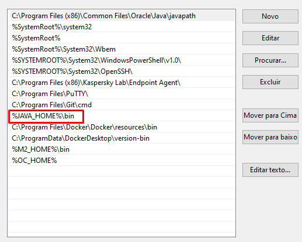

    6.5. Reinicie o sistema

    6.6. Após reiniciar, abra o seu terminal (CMD, Windows Terminal etc) e digite:

    ```code
    java -version
    ```
    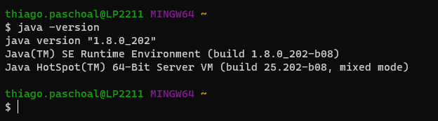

<div id="ambiente-eclipse">
    <h1>Instalando e configurando o Eclipse</h1>
</div>

1. Clique no link, nomeado como `Eclipse` no README.md onde configuramos o ambiente Java

2. Clique no botão 'Download x86_64'

	

3. Clique em ***'Download'***

	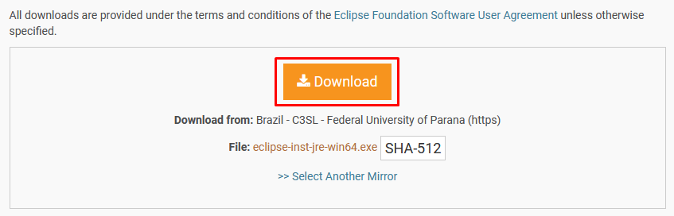

4. Download sendo feito.

	

5. Terminando o download, execute o instalador

6. Clique na IDE - `Eclipse IDE for Java Developers`

	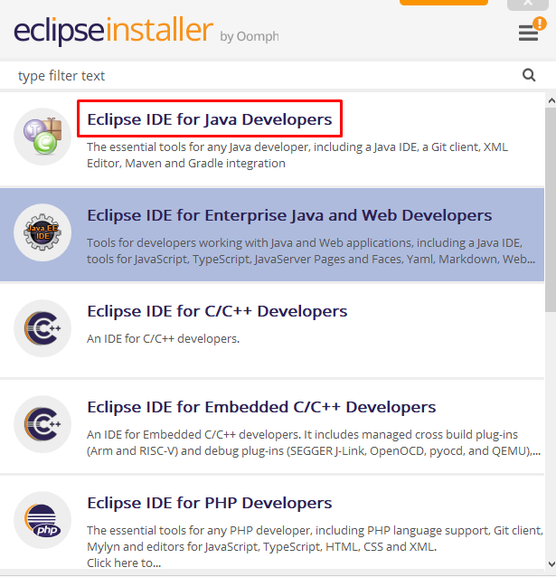

7. Selecione em qual diretório deseja realizar a instalação e depois clique em `Install`

	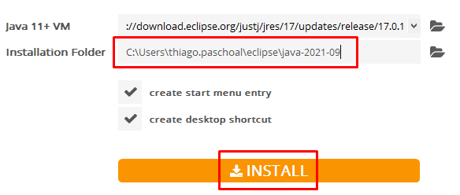

8. Clique em `Accept Now` para aceitar os termos do contrato

9. Aguarde a instalação finalizar. (Pode demorar um pouco)

	

10. Finalizou a instalação (Alellluiiaa). Clique em `Launch`

	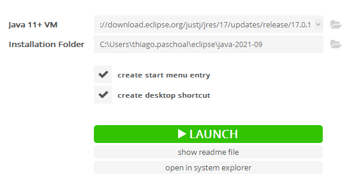

11. Olha aíiiiii!!!

	

12. Use a default ou se quiser pode apontar para seu workspace desejada onde vão ficar os projetos Java.

	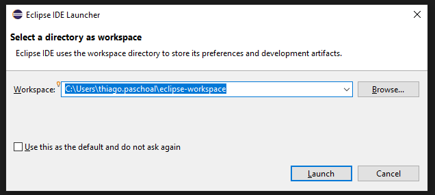

13. Feito isso, clique em `Launch` e aguarda a inicialização da IDE.

14. Pronto!!!

	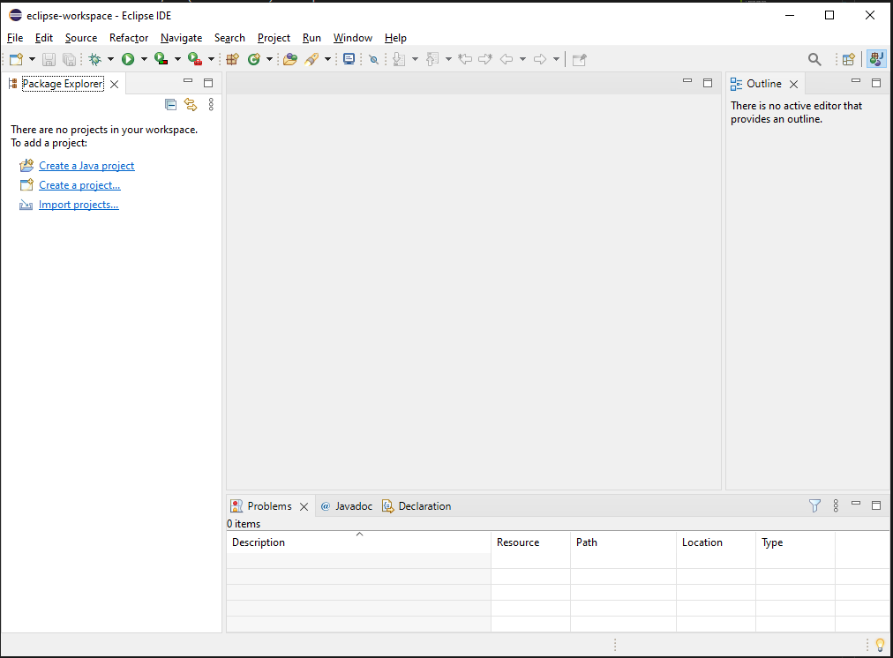

<div id="hello-world">
    <h1>Criando e executando nosso primeiro programa Java</h1>
</div>

Neste capítulo do nosso treinamento, vamos iniciar o desenvolvimento do nosso primeiro projeto. Vamos começar com algo simple, bem simples mas que nós trás bastantes insights e explicações. Todos nos já passamos pelo bom e velho ***Hello-World***.

#### ***Criando o projeto no Eclipse***

1. Clique em `Create Java Project`

	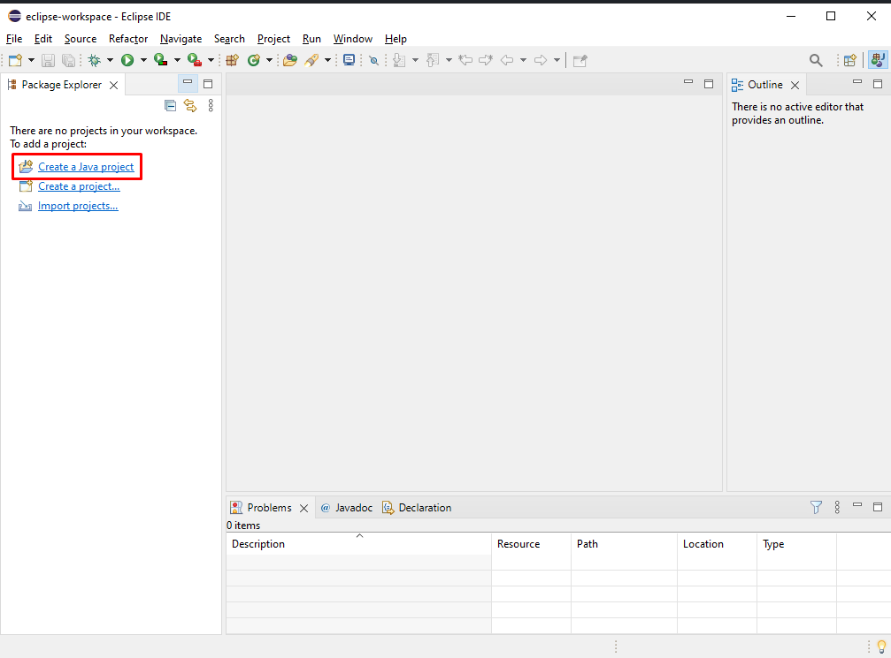

2. Digite o nome do projeto no campo `Project Name` e depois clique em `Finish`

	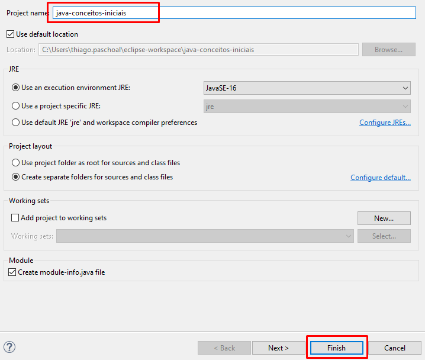

3. Se aparecer uma janela pedindo para vc criar um `module.info` clique em `Dont't Create`

4. Clique com o botão direito na pasta `src` dentro do projeto e depois em `New` e depois em `Class`

	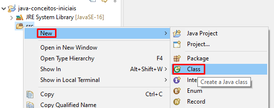

5. Digite o nome `HelloWorld` no campo `Name` e depois clique em `Finish`

	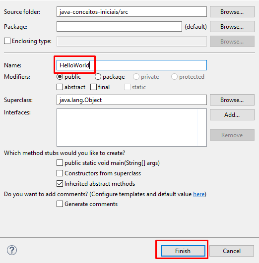

6. Você vai ter uam visualização igual a essa

	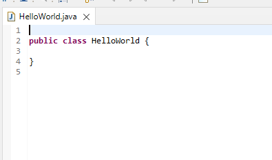

7. Digite este bloco de código. (evite copiar, digite para fixar o conteudo)

```java
public class HelloWorld {
    public static void main (String[] args) {
        System.out.println("Hello World");
    }
}
```

#### ***Executando o projeto no Eclipse***

1. Para executar o nosso projeto, clique com o botão direito em cima da classe (código) - `Run As` e depois clique em `Java Application`

	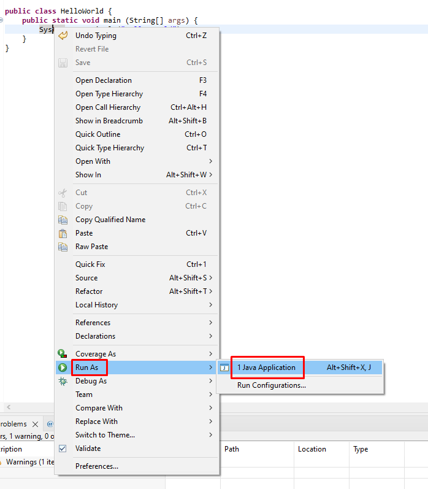

2. Se liga no resultado no console. Se vc conseguiu esse mesmo resultado!! Parabénss!! Vc está no caminho certo.

	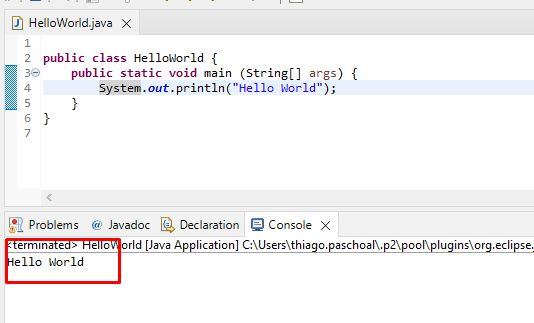


<div id="variaveis">
    <h1>Criando dados para nosso programa (Variáveis)</h1>
</div>

- ***Qual a motivação em declarar uma variável?***
- ***Como declarar?***
- ***Quais os tipos possíveis de variáveis/atributos em Java?***
- ***Eu posso mudar converter um tipo para outro?***

Dentro de um bloco, podemos declarar variáveis e usá-las. Em Java, toda `variável` tem um tipo que não pode ser mudado uma vez declarado:

```code
tipoDaVariavel nomeDaVariavel;
```

| Tipos | Tamanho |
| ----------- | ----------- |
| `boolean` | 1 bit |
| `byte` | 1 byte | 
| `char` | 2 bytes | 
| `short` | 2 bytes | 
| `int` | 4 bytes | 
| `float` | 4 bytes | 
| `long` | 8 bytes | 
| `double` | 8 bytes | 

```java
int idade = 18;
String mensagemEsperada = "Sistema Indisponível";
char sexo = 'M';
boolean hasAttributes = true;
double pi = 3.14;
boolean menorDeIdade = idade < 18;
double x = 5 * 10;
```

- ***Operadores Aritméticos***

    -   `+` (Soma/Concatenação)

    ```java
    int valor = 19;
    int resultado = valor + 2;
    System.out.println(resultado); // 21
    ```

    -   `-` (Subtração)

    ```java
    int valor = 10;
    int resultado = valor - 2;
    System.out.println(resultado); // 8
    ```
    -   `*` (Multiplicação)

    ```java
    int valor = 5;
    int resultado = valor * 2;
    System.out.println(resultado); // 10
    ```
    -   `/` (Divisão)

    ```java
    int valor = 4;
    int resultado = valor / 2;
    System.out.println(resultado); // 2
    ```
    -  `%` (Resto)

    ```java
    int valor = 4;
    boolean ehPar = valor % 2 == 0;
    System.out.println(ehPar); // true
    ```

    ### ***CUIDADO***

    Quando estamos usando o operador de soma entre texto, por mais que o valor do texto seja um número o resultado será apenas a junção de ambos:

    ```java
    String valor = "20";
    String resultado = valor + 2;
    System.out.println(resultado); // 202
    ```
- ***Operadores Relacionais***
    -   `==` (Igual/Comparaçao)

    ```java
    double valor = 3.14;
    boolean resultado = valor == 3;
    System.out.println(resultado); // false
    ```
    -   `!=` (Diferente)

    ```java
    double valor = 3.14;
    boolean resultado = valor != 3;
    System.out.println(resultado); // true
    ```
    -   `>` (Maior)

    ```java
    double valor = 89;
    boolean resultado = valor > 100;
    System.out.println(resultado); // false
    ```
    -   `<` (Menor)

    ```java
    double valor = 89;
    boolean resultado = valor < 100;
    System.out.println(resultado); // true
    ```
    -  `>=` (Maior ou igual)

    ```java
    double valor = 3;
    boolean resultado = valor >= 3;
    System.out.println(resultado); // true
    ```

    ```java
    double valor = 1;
    boolean resultado = valor >= 3;
    System.out.println(resultado); // false
    ```

    ```java
    double valor = 17;
    boolean resultado = valor >= 3;
    System.out.println(resultado); // true
    ```

    -  `<=` (Menor ou igual)

    ```java
    double valor = 4;
    boolean resultado = valor <= 3;
    System.out.println(resultado); // false
    ```

    ```java
    double valor = 1;
    boolean resultado = valor <= 3;
    System.out.println(resultado); // true
    ```

- ***Operadores Lógicos***

    -   `&&` (E)

    ```java
    boolean podeDirigir = true;
    boolean podeBeber = idade >= 18;
    boolean resultado = podeDirigir && podeBeber;
    System.out.println(resultado); // true
    ```

    -   `||` (OU)

    ```java
    boolean erroStatusCode = 404;
    boolean resultado = erro == 404 || erro == 400;
    System.out.println(resultado); // true
    ```

<div id="estruturas">
    <h1>Dando poder de decisão para nosso programa</h1>
</div>

- ***if-else***

    - No Java, a sintaxe do `if-else` é a seguinte:

    ```java
    if (condicaoBooleana) {
        codigo;
    }
    ```
    Uma condição booleana é qualquer expressão que retorne true ou false. Para isso, você pode usar os operadores <, >, <=, >= e operadores lógicos. Um exemplo:

    ```java
    int idade = 15;
    if (idade < 18) {
        System.out.println("Não pode entrar");
    }
    ```

    Além disso, você pode usar a cláusula else para indicar o comportamento que deve ser executado no caso da expressão booleana ser falsa:

    ```java
    int idade = 15;
    if (idade < 18) {
        System.out.println("Não pode entrar");
    } else {
        System.out.println("Pode entrar");
    }
    ```

- ***switch***

    - No Java, a sintaxe do `switch` é a seguinte:

    ```java
    switch (valor) {
        case valores:
        // o que fazer
        break;
        default:
            // caso default
    }
    ```

    Para demonstrar o uso do `switch`, vamos criar uma simple ***Calculdora***.

    ```java
    char operador = '+';
    int numero1 = 4;
    int numero2 = 8;
    double resultado = 0D;
    switch (operador) {
        case '+':
        resultado = numero1 + numero2;
        break;
        case '-':
        resultado = numero1 - numero2;
        break;
        case '*'
        resultado = numero1 * numero2;
        break;
        case '/':
        resultado = numero1 / numero2;
        break;
        default:
            System.out.println("operador inválido");
    }
    ```

- ***while***

    - O `while` é um comando usado para fazer um laço (loop), isto é, repetir um trecho de código algumas vezes. A ideia é que esse trecho de código seja repetido enquanto uma determinada condição permanecer verdadeira.

        ```java
        while (expressao-booleana) {
            // execute e pare quando a condiçao for falsa
        }
        ```

        Para demonstrar o uso do while, vamos criar uma simples ***Tabuada***.

        ```java
        int valor = 4;
        int counter = 0;
        while (counter <= 10) {
            System.out.println(valor + "*" + counter + "=" + (valor*counter));
            counter++;
        }
        ```

- ***for***

    - Outro comando de loop extremamente utilizado é o `for`. A ideia é a mesma do `while`: fazer um trecho de código ser repetido, enquanto uma condição continuar verdadeira. Mas, além disso, o for isola também um espaço para inicialização de variáveis e o modificador dessas variáveis. Isso faz com que as variáveis relacionadas ao loop fiquem mais legíveis:

        No Java, a estrutura do for é a seguinte:

        ```java
        for (inicializacao; condicao; incremento) {
            // codigo;
        }
        ```

        Vamos adaptar o exemplo da ***Tabuada*** do exemplo anterior para usar o ***for***

        ```java
        int valor = 4;
        for (int i = 0; i <= 10; i++) {
            System.out.println(valor + "*" + i + "=" + (valor*i));
        }
        ```

<div id="oo">
    <h1>Falando um pouco sobre classes e objetos</h1>
</div>

- 4 pilares da Orientação de Objetos

    - `Abstração`
    - `Encapsulamento`
    - `Herança`
    - `Polimorfismo`

- Vamos tomar como exemplo, uma classe de nome `Funcionario`.

```java
public class Conta {
    
    public String titular;
    public Long cpf;
    public Double saldo;
    public String departamento;
    // .. outros atributos

	public void deposita(double valor) {
		if (valor <= 0) {
			throw new RuntimeException("saldo não pode ser menor ou igual a zero.");
		}
		this.saldo += valor;
	}

}
```

Ao projeto da conta, isto é, à definição da conta, damos o nome de `classe`. Ao que podemos construir a partir desse projeto; às contas de verdade, damos o nome de `objetos`.

- `Atributos`
- `Métodos`

#### Testando nossa classe

Para instanciarmos e começar a manipular o nosso objeto (classe) usamos a palavra reservada `new`. Está deve ser usada da seguinte forma:

```java
public class TestaConta {
    public static void main (String[] args) {
        Conta conta = new Conta();
        conta.titular = "Thiago Sakurai Paschoal";
        conta.cpf = 99999999999L;
        conta.saldo = 2500D;
        System.out.println("Saldo inicial: " + conta.saldo);

        conta.deposita(1000D);
        System.out.println("Saldo depois do deposito: " + conta.saldo);
    }
}
```

- **Algumas perguntas sobre este teste!!!**

    1. **É um teste automatizado?**
    2. **Este teste nos dá um feedback rápido?**
    3. **Este teste se auto-valida?**
    4. **Este teste pode ser executado repetidas vezes?**

Como vamos responder essas perguntas? Fica para o próximo episódio deste treinamento.
