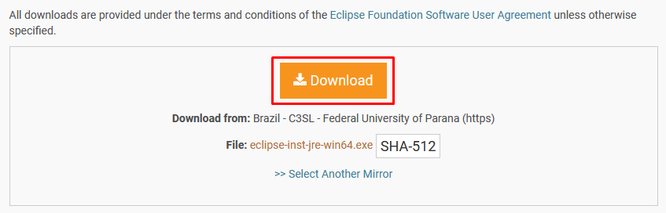
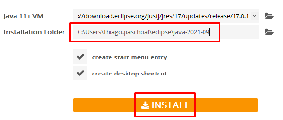
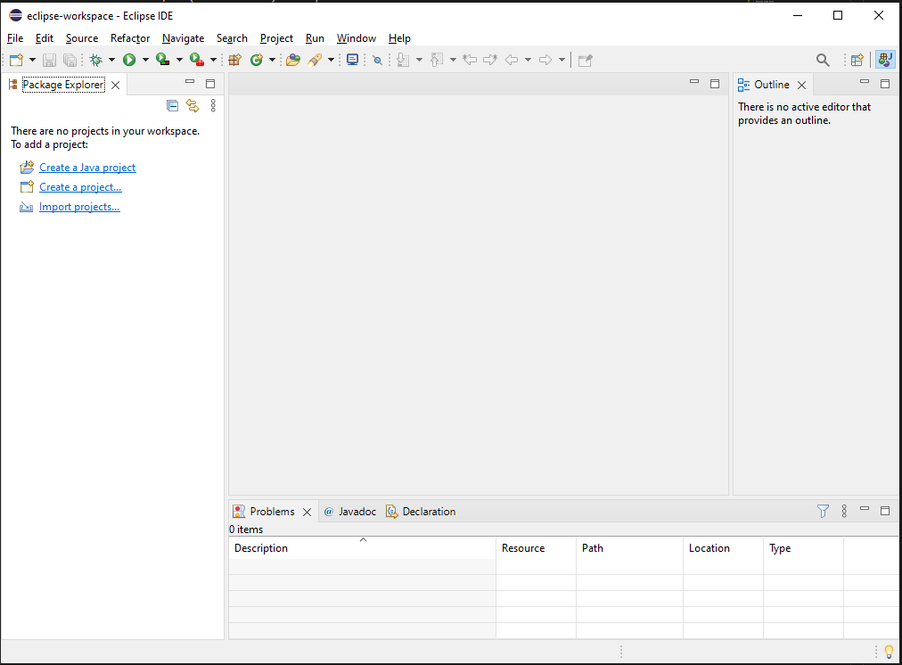

<h1 align="center">Instalando e configurando o Eclipse</h1>

Thiago Sakurai Paschoal

<h4> 
	 <strong>Passo a passo</strong>
</h4>

1. Clique no link, nomeado como `Eclipse` no README.md onde configuramos o ambiente Java

2. Clique no botão 'Download x86_64'

	

3. Clique em ***'Download'***

	

4. Download sendo feito.

	

5. Terminando o download, execute o instalador

6. Clique na IDE - `Eclipse IDE for Java Developers`

	

7. Selecione em qual diretório deseja realizar a instalação e depois clique em `Install`

	

8. Clique em `Accept Now` para aceitar os termos do contrato

9. Aguarde a instalação finalizar. (Pode demorar um pouco)

	

10. Finalizou a instalação (Alellluiiaa). Clique em `Launch`

	

11. Olha aíiiiii!!!

	

12. Use a default ou se quiser pode apontar para seu workspace desejada onde vão ficar os projetos Java.

	

13. Feito isso, clique em `Launch` e aguarda a inicialização da IDE.

14. Pronto!!!

	

## Excelente, se vc chegou até aqui com sucesso significa que seu ambiente Eclipse está completo!!!! Topzera
