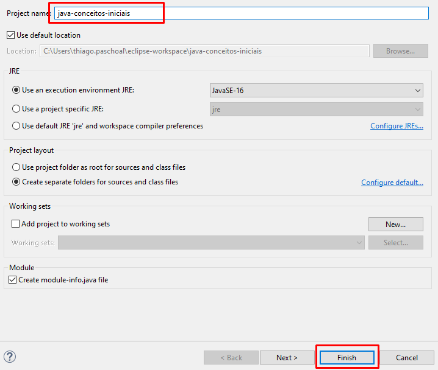
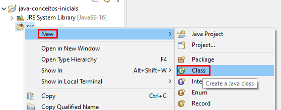
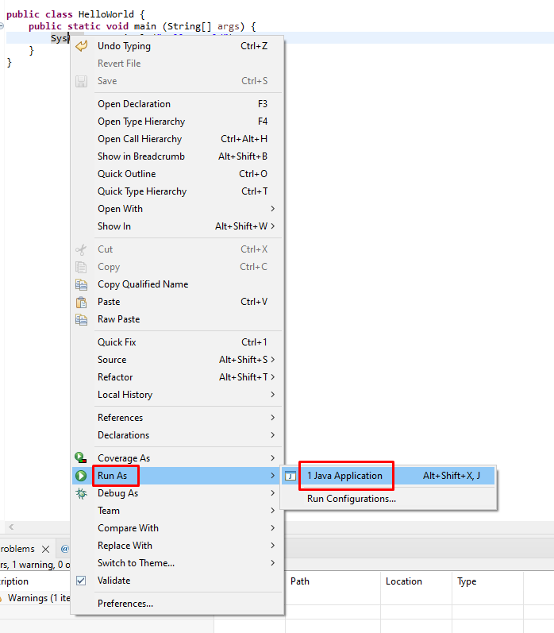
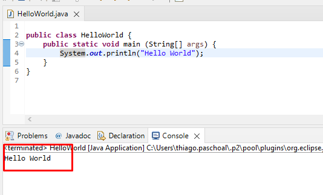

<h1 align="center">Criando e executando nosso primeiro programa Java</h1>
<p align="center">Thiago Sakurai Paschoal</p>


Neste capítulo do nosso treinamento, vamos iniciar o desenvolvimento do nosso primeiro projeto. Vamos começar com algo simple, bem simples mas que nós trás bastantes insights e explicações. Todos nos já passamos pelo bom e velho ***Hello-World***.

#### ***Criando o projeto no Eclipse***

1. Clique em `Create Java Project`

	

2. Digite o nome do projeto no campo `Project Name` e depois clique em `Finish`

	

3. Se aparecer uma janela pedindo para vc criar um `module.info` clique em `Dont't Create`

4. Clique com o botão direito na pasta `src` dentro do projeto e depois em `New` e depois em `Class`

	

5. Digite o nome `HelloWorld` no campo `Name` e depois clique em `Finish`

	

6. Você vai ter uam visualização igual a essa

	

7. Digite este bloco de código. (evite copiar, digite para fixar o conteudo)

```java
public class HelloWorld {
    public static void main (String[] args) {
        System.out.println("Hello World");
    }
}
```

#### ***Executando o projeto no Eclipse***

1. Para executar o nosso projeto, clique com o botão direito em cima da classe (código) - `Run As` e depois clique em `Java Application`

	

2. Se liga no resultado no console. Se vc conseguiu esse mesmo resultado!! Parabénss!! Vc está no caminho certo.

	