<h1 align="center">JUnit 5</h1>
<p align="center">Thiago Sakurai Paschoal</p>


*"O teste automatizado existe não só para garantir que seu software está funcionando apenas naquele momento. Ele existe para garantir que seu software sempre funcionará independente de atualizações."* (Maurício Aniche)

Neste capítulo do nosso treinamento, vamos iniciar o desenvolvimento do nossos testes usando as nossas duas classes desenvolvidas no treinamento anterior. Lembra? `TestaConta` e `Conta`.

Nossa que massa! Mas como vamos fazer isso? Eis a questão.

# Um pouco sobre JUnit 5


JUnit 5 é extremamente usado para testes unitários em pequenas ou grandes aplicações feitas em Java. Mas existe apenas o JUnit 5? Não, existem outras como por exemplo o TestNG.

Para começar primeiro, vamos criar um novo projeto e adaptar nossas duas classes a este. Lembrando que este mesmo projeto será usado agora até o fim deste treinamento. Para nos ajudar a criar este projeto, vamos usar o `Maven` que nada mais é do que uma ferramenta (mais uma para colocar no nosso cinto de utilidades! Estamos no nível Batman heim!!) para automatização de build e gerenciamento de depêndencia. Não abordaremos em detalhes o Maven neste treinamento.

Após isso, usaremos o JUnit 5 como forma para testarmos o nosso código. 

# Iniciando com o JUnit 5

#### ***Criando o projeto Maven no Eclipse***

1. Clique em `File` > `New` > `Other`

	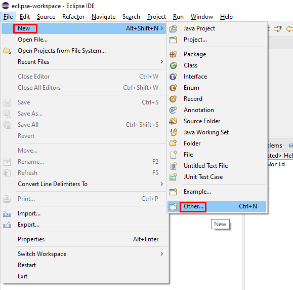

2. Clique na opção `Maven Project` e depois clique em `Next`

	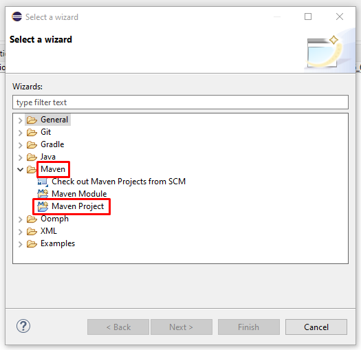

3. Marque a opção de `Create a simple project (skip archetype selection)` e depois clique em `Next`

	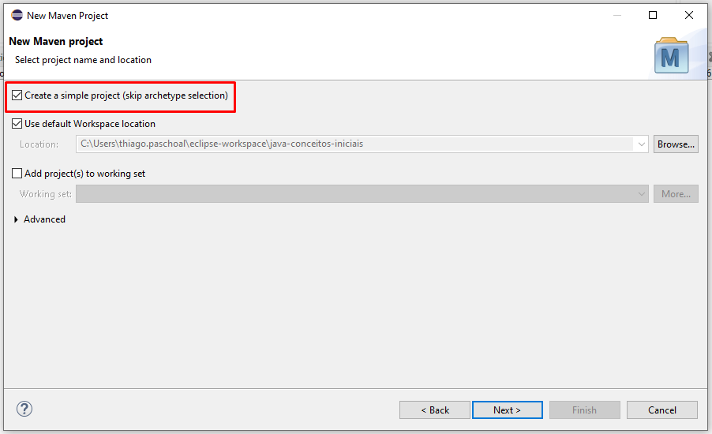

4. Preencha os campos `Group Id` e `Artifact Id` com os valores correspondentes abaixo:

	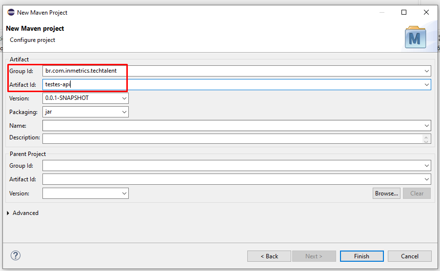

5. Clique em `Finish`

6. Projeto Criado

	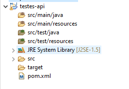

#### ***Adicionando e configurando o JUnit 5 no nosso projeto***

Depois de ter criado o projeto no step anterior, vamos configurar o JUnit 5 no nosso projeto para isso vamos abrir o arquivo `pom.xml` localizado na raiz do projeto.

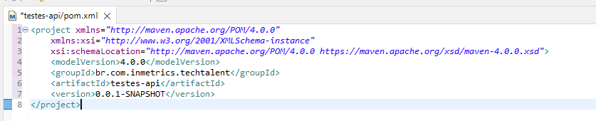

1. Adicione as seguinte dependências abaixo: (este trecho de código deve ser adicionado ates do fechamento da tag `</project>`)

```code
	<properties>
		<project.build.sourceEncoding>UTF-8</project.build.sourceEncoding>
		<maven.compiler.source>1.8</maven.compiler.source>
		<maven.compiler.target>1.8</maven.compiler.target>
	</properties>
	<dependencies>
        <dependency>
            <groupId>org.junit.jupiter</groupId>
            <artifactId>junit-jupiter-engine</artifactId>
            <version>5.7.0</version>
            <scope>test</scope>
        </dependency>
        <dependency>
            <groupId>org.junit.jupiter</groupId>
            <artifactId>junit-jupiter-params</artifactId>
            <version>5.7.0</version>
        </dependency>
	</dependencies>
	<build>
		<plugins>
			<plugin>
				<artifactId>maven-compiler-plugin</artifactId>
				<version>3.8.1</version>
			</plugin>
			<plugin>
				<groupId>org.apache.maven.plugins</groupId>
				<artifactId>maven-surefire-plugin</artifactId>
				<version>2.22.2</version>
				<configuration>
					<argLine>
						--illegal-access=permit
					</argLine>
				</configuration>
			</plugin>
			<plugin>
				<groupId>org.apache.maven.plugins</groupId>
				<artifactId>maven-failsafe-plugin</artifactId>
				<version>2.22.2</version>
				<configuration>
					<argLine>
						--illegal-access=permit
					</argLine>
				</configuration>
			</plugin>
		</plugins>
	</build>
```

2. Clique com botão direito no nome do projeto e depois selecione `Maven` > `Update Project`

	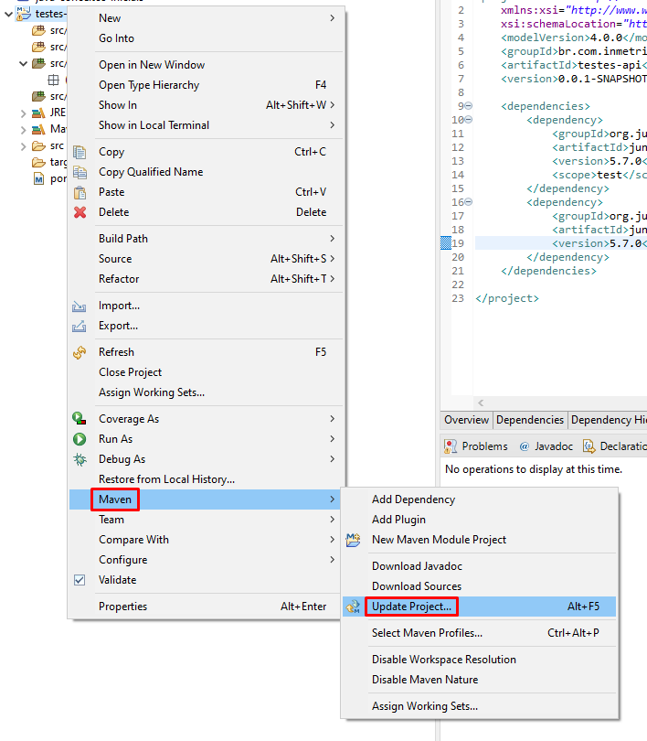

3. Selecione a opção `Force Update of Snapshots/Releases` e depois clique em `Ok`

	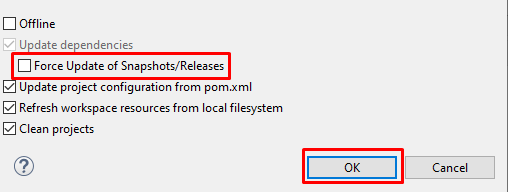

4. Aguarde até que todas as dependências sejam baixadas e configuradas

### Criando nosso primeiro teste

1. Crie uma classe no package `src/test/java` chamada `ContaTest`

	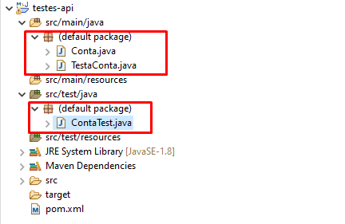

2. Implemente os seguintes testes automatizados

	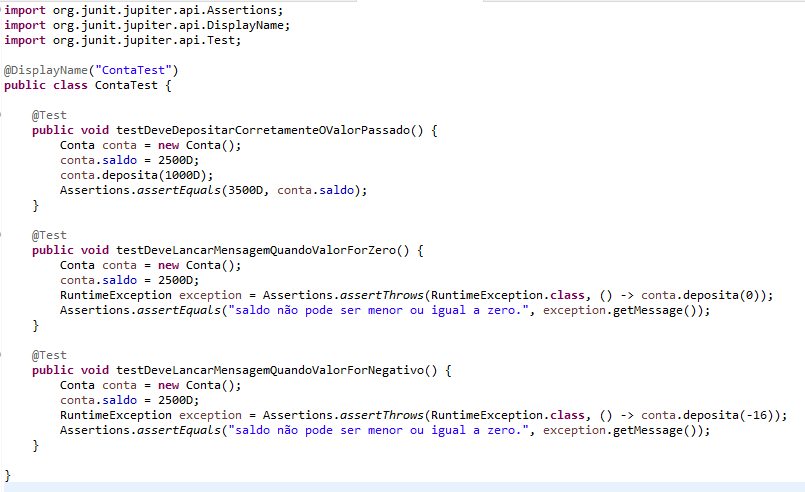

### Executando nosso teste

1. Para executar os testes clique com o botão direito no nome do arquivo e siga os seguintes diretorios `Run As` > `JUnit Test`

	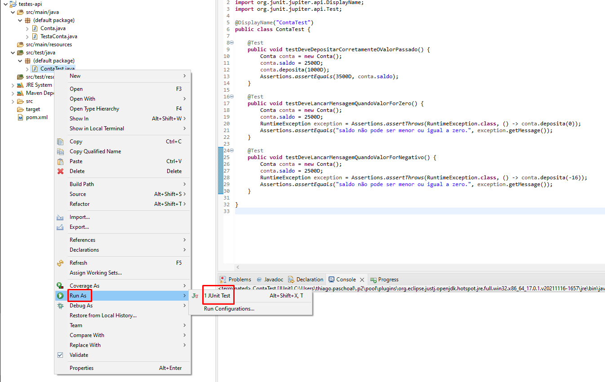

2. Feedback da execução dos testes

	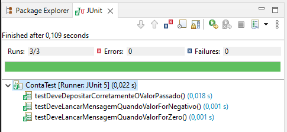

### Desafio

Crie uma classe chamada Conta que possui os seguintes atributos `nome`, `cpf`, `dataDeInclusao`, `salario` e que tenha os comportamentos de `sacar` e `depositar`. Lembre-se que precisamos testar todos os possíveis cenários de teste apenas nessa classe. Lembre-se de adicionar sempre a anotação `@Test` em todos os seus métodos da classe de teste. Outro ponto eu não posso sacar se eu não tiver saldo disponivel na conta ou se o valor for maior do que o saldo q eu tenho na conta.
