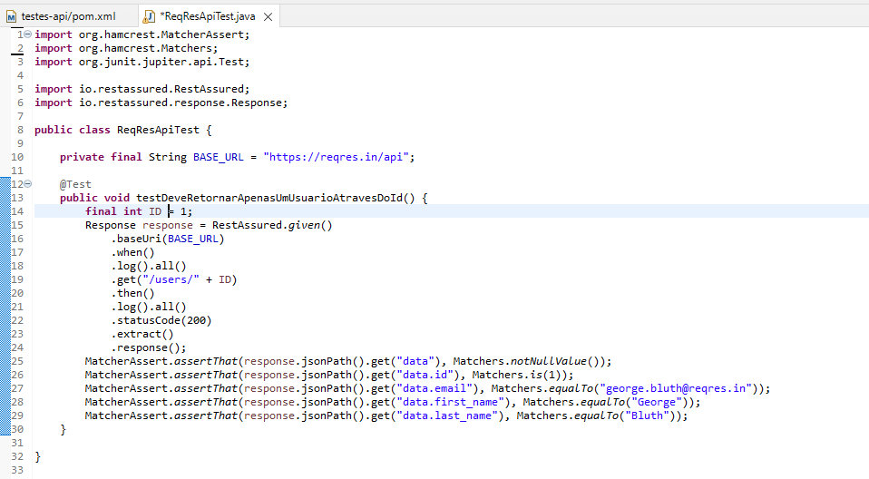
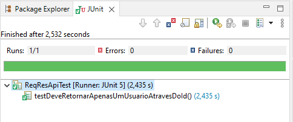
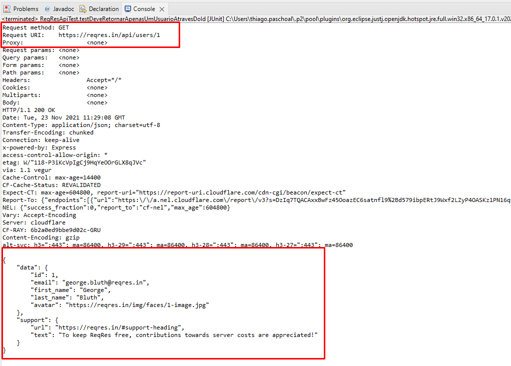
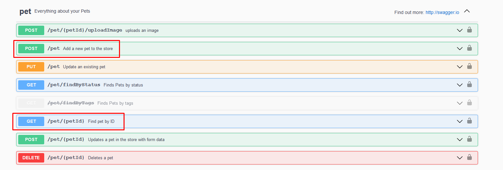

<h1 align="center">Rest Assured</h1>
<p align="center">Thiago Sakurai Paschoal</p>

Ahhhhhh mlkkkkk!! Chegamos no final do nosso super-treinamento!! 


Neste ultimo dia/módulo nos vamos explorar como testar uma API Rest usando a biblioteca Rest-Assured (vide titulo). 

# Um pouco sobre Rest Assured


O Rest Assured nos permite testar serviços RESTful em Java de uma maneira muito mais simples, basicamente, ele nos provê uma maneira de criar chamadas HTTP, como se fossemos um cliente acessando a API.

**Links importantes para esta seção:**

[Página oficial do Rest Assured](https://rest-assured.io/)

# Iniciando com o Rest Assured

 Vamos aprender como configura-lá no projeto e executar um teste usando a api [ReqRes](https://reqres.in/) disponibilizada gratuitamente para testes. No final teremos um super-desafio que vai agregar tudo que vimos até agora.

Neste ultimo módulo não entraremos a fundo nos conceito de Api Rest. Deixaremos isso para outro momento. Pode ser até um café virtual! huahahuahuah

Vcs lembram do projeto que fizemos na aula passada? Então vamos usar ele! Agora vai ficar loko!!!

#### ***Adicionando e configurando o Rest Assured no nosso projeto***

Basta adicionar apenas essa dependência dentro da tag `<dependencies>` no `pom.xml` que vimos na aula anterior e depois apenas `Salvar`.

```code
	<dependency>
        <groupId>io.rest-assured</groupId>
        <artifactId>rest-assured</artifactId>
        <version>3.3.0</version>
    </dependency>
```

### Criando nosso primeiro teste

Neste ponto vamos entender passo a passo como criar e adaptar o nosso projeto ao rest-assured de uma forma bem simples para que assim vc aluno(a) possa sempre melhorá-lo.

1. Para começar vamos criar nossa primeira classe de teste? Lembra, como fazer?.

2. Vamos nomea-lá como `ReqResApiTest` e depois clicar em `Finish`.

3. Crie uma variavel do tipo `String` e vamos chamá-la de `BASE_URL`.

```java
private final String BASE_URL = "https://reqres.in/api";
```

4. Vamos explorar um pouco nosso API, antes de escrevermos os testes.

5. Agora que entendemos e analisamos quais cenários vamos automatizar é hora de partir para o código.

6. Crie um método chamado `testDeveRetornarApenasUmUsuarioAtravesDoId()`.

7. Agora dentro deste método vamos escrever o seguinte conteúdo.

```java
		final int ID = 1;
		Response response = RestAssured.given()
			.baseUri(BASE_URL)
			.when()
			.log().all()
			.get("/users/" + ID)
			.then()
			.log().all()
			.statusCode(200)
			.extract()
			.response();
		MatcherAssert.assertThat(response.jsonPath().get("data"), Matchers.notNullValue());
		MatcherAssert.assertThat(response.jsonPath().get("data.id"), Matchers.is(1));
		MatcherAssert.assertThat(response.jsonPath().get("data.email"), Matchers.equalTo("george.bluth@reqres.in"));
		MatcherAssert.assertThat(response.jsonPath().get("data.first_name"), Matchers.equalTo("George"));
		MatcherAssert.assertThat(response.jsonPath().get("data.last_name"), Matchers.equalTo("Bluth"));
```



### Executando nosso teste

1. Para executar os testes clique com o botão direito no nome do arquivo e siga os seguintes diretorios `Run As` > `JUnit Test`

2. Feedback dos testes



3. Request-Response no Console




# Desafio

Para este e ultimo desafio nos vamos automatizar os seguintes endpoints (destacados em vermelho). Abaixo algumas informações a considerar. Considerar também o cenário de teste quando o pet não existe para o Id passado.



Instruções

1. Crie um novo projeto
2. `BASE_URL`  a ser usada `https://petstore.swagger.io/v2/`
3. O que eu preciso saber para fazer o `POST`? (este deixo para vcs procurarem! mas podem me chamar a qlqr momento)

	- Mudar ao invés de `get` no Rest-Assured use o método `post`
	- Usar o método `body` antes de realizar o `post`
	- Exemplo do body:

		```json
		{
			"id": 0,
			"category": {
				"id": 0,
				"name": "vira-lata"
			},
			"name": "stark",
			"photoUrls": [
				"string"
			],
			"tags": [
				{
				"id": 0,
				"name": "string"
				}
			],
			"status": "available"
		}
		```
	Para este cenário validar apenas o `status code` que deve ser `200`.

Quando terminarem os desafios me mandem os projetos (zipados) eu quero muito ver!!!

## Pessoal, chegamos ao fim deste treinamento. Quero agradecer demais a todos vcs por participarem. Qlqr dúvida é só me chamar no Teams como também os outros professores para ajudar. Espero poder trabalhar com vcs um dia!! Boa sorte a todos!!!


# Que a força esteja com vcs!!
